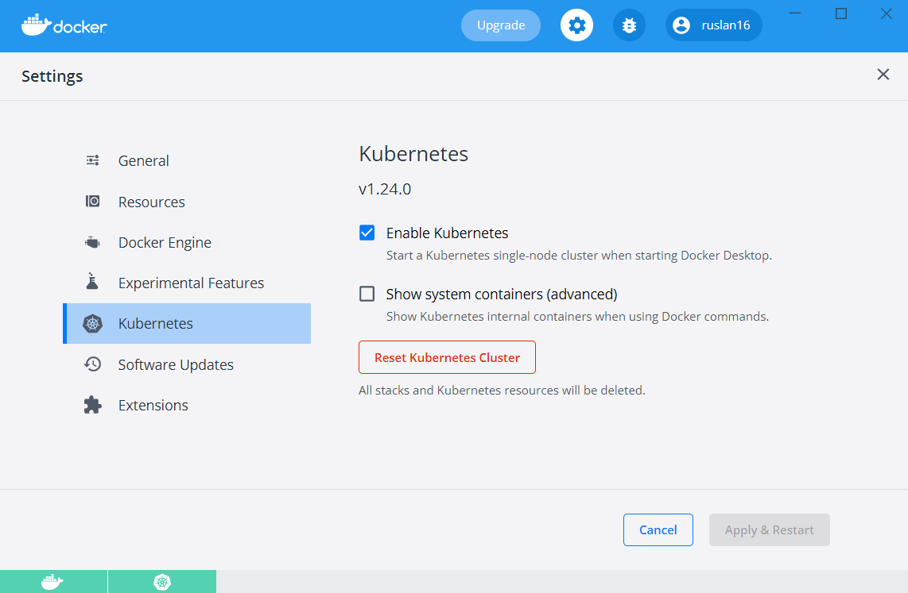
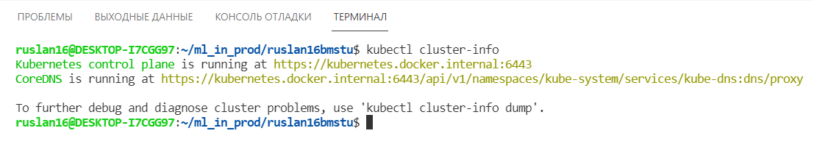
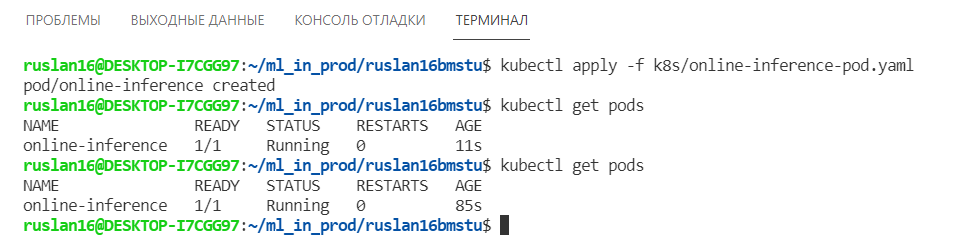

# Домашнее задание №4
## Способ установки
Kubernetes развернут локально через функционал `Docker Desktop`.

## Поднятый кластер
```
kubectl cluster-info
```


## Запуск и проверка
```
kubectl apply -f k8s/online-inference-pod.yaml
kubectl get pods
```

## ReplicaSet
Если сменить docker образ в манифесте и одновременно с этим:
* уменьшить число реплик, то останутся только старые реплики
* увеличить число реплик, то старые реплики дополнятся новыми
## Online inference v2
Описанная в задании работа приложения реализована с помощью функционала библиотеки `time`: добавлено ожидание при запаске и исключение при достижении 90 секунд работы.
